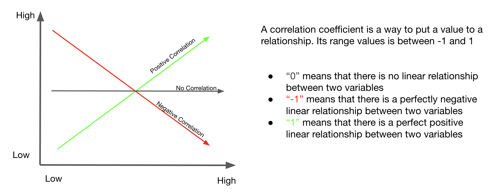
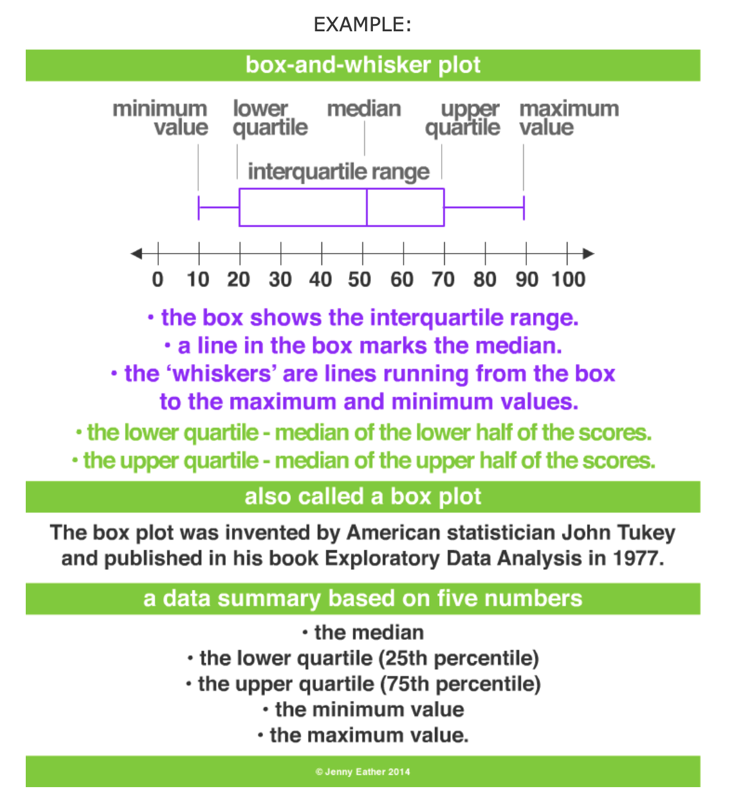

```{r setup, include=FALSE}
knitr::opts_chunk$set(echo = FALSE)

```


```{r, out.width=800, out.extra='style="border: 1px solid #464646;" allowfullscreen="" allow="autoplay"'}
knitr::include_url("https://adrian701.github.io/DS_HPEGLCP/labs/lab-deck-00#/title-slide", height = 480)
```

[This Week's Slide Link](https://adrian701.github.io/DS_HPEGLCP/labs/lab-deck-00#/title-slide)


<br>
```{r read_df, warning=FALSE, message=FALSE}

bike_df <- read.csv("/Users/aesparza/Documents/Bike-Sharing/train.csv", header = T, stringsAsFactors = F)

#datatable(bike_df, class = 'cell-border stripe', rownames = FALSE)
```


## Understanding our data!


#### Data Fields
```
datetime - hourly date + timestamp  
season -  1 = spring, 2 = summer, 3 = fall, 4 = winter 
holiday - whether the day is considered a holiday
workingday - whether the day is neither a weekend nor holiday
weather - 1: Clear, Few clouds, Partly cloudy, Partly cloudy
2: Mist + Cloudy, Mist + Broken clouds, Mist + Few clouds, Mist
3: Light Snow, Light Rain + Thunderstorm + Scattered clouds, Light Rain + Scattered clouds
4: Heavy Rain + Ice Pallets + Thunderstorm + Mist, Snow + Fog 
temp - temperature in Celsius
atemp - "feels like" temperature in Celsius
humidity - relative humidity
windspeed - wind speed
casual - number of non-registered user rentals initiated
registered - number of registered user rentals initiated
count - number of total rentals
```


We will be using [R](https://www.r-project.org/) on this blog while having support for python via [Google Colab](https://colab.research.google.com/drive/13Z1r_c23UXxDCd99-RIArOcbxE2yz3Xg?usp=sharing). We have many open-source tools at our disposal and will use a host of libraries to make our lives easier. 

```{r describe, warning=FALSE, message=FALSE, echo=TRUE}
library(DT)
library(skimr)

datatable(bike_df, class = 'cell-border stripe', rownames = FALSE)

skim(bike_df)

```


### Covering the basics 

{#id .class width=100% height=100%}

### Correlation plot for our data
```{r correlation,  warning=FALSE, message=FALSE, echo=TRUE}

library(ggplot2)
library(tidyverse)
library(Hmisc)

cors <- function(df) {
  M <- Hmisc::rcorr(as.matrix(df[,-1]))
  Mdf <- map(M, ~data.frame(.x))
  return(Mdf)
}

formatted_cors <- function(df){
  cors(df[,-1]) %>%
    map(~rownames_to_column(.x, var="measure1")) %>%
    map(~pivot_longer(.x, -measure1, "measure2")) %>%
    bind_rows(.id = "id") %>%
    pivot_wider(names_from = id, values_from = value) %>%
    rename(p = P) %>%
    mutate(sig_p = ifelse(p < .05, T, F),
           p_if_sig = ifelse(sig_p, p, NA),
           r_if_sig = ifelse(sig_p, r, NA)) 
}


## use graphics in ggplot2 to make the pretty correlation plot
formatted_cors(bike_df) %>%
  ggplot(aes(measure1, measure2, fill=r, label=round(r_if_sig,2))) +
  geom_tile() +
  labs(x = NULL, y = NULL, fill = "Pearson's\nCorrelation", title="Correlations in Bike-Sharing Data",
       subtitle="Only significant Pearson's correlation coefficients shown") +
  scale_fill_gradient2(mid="#FBFEF9",low="#0C6291",high="#A63446", limits=c(-1,1)) +
  geom_text() +
  theme_classic() +
  scale_x_discrete(expand=c(0,0)) +
  scale_y_discrete(expand=c(0,0)) +
  theme(text=element_text(family="Roboto"))

```


Notice the high  correlation between **count (our target feature)** and **casual** and **registered**. Before we get too excited about this strong, positive linear relationship, it would be helpful to revisit the definition of these features.

```
casual - number of non-registered user rentals initiated
registered - number of registered user rentals initiated
```

Adding these together sum up to the number of bike **count** rentals.
$count = casual + registered$

One way we can use this information for predicting future demand is to evaluate the how well these two figures track and possibly use these trends to fit a [time series model](http://r-statistics.co/Time-Series-Analysis-With-R.html).

### let's plot the trends

```{r trend_prep,  warning=FALSE, message=FALSE, echo=TRUE}

## we need to shape data and create a group feature to fit out schema required by our plot
## see: https://jkunst.com/highcharter/articles/highcharter.html
library(highcharter)

# we need to pivot the data from long to wide
pivot_bike <- bike_df %>% 
  ## filter our data to only 3 features (datetime, causal, registered)
  select(datetime, casual:registered) %>%
  ## transform datetime to date 
  ## substring for first 10 character and make to date
  mutate(datetime = as.Date(substr(datetime,1,10))) %>%
  ## pivot from wide to long format
  pivot_longer(!datetime,
               names_to = "group",
               values_to = "total") %>%
  ## now we group by date since we deleted the hour and sum for group
  group_by(datetime, group) %>%
  summarise(total = sum(total))

    
## let's look at the data
head(pivot_bike )

```


```{r trend_plot,  warning=FALSE, message=FALSE, echo=TRUE}
## time to make fancy plot
hchart(pivot_bike, "line", hcaes(x = datetime, y = total, group = group))

```


This is too noisy. Let's attempt to round the data down to the week by using **floor_date()** function from the package `lubridate`


```{r trend_plot_week,  warning=FALSE, message=FALSE, echo=TRUE}

library(lubridate)

## round dates down to week and recalculate total 
pivot_bike_week <- pivot_bike %>% 
  mutate(week_datetime= floor_date(datetime, "week")) %>%
  group_by(group, week_datetime) %>% 
  ## this cool function tells R to sum for features that are only numeric (ignore dates)
  summarise_if(is.numeric, sum)

## time to make fancy plot
hchart(pivot_bike_week, "line", hcaes(x = week_datetime, y = total, group = group))

```

Less noisy and can visualize trends. 


### Exercise 
> Do you think we should roll up to the monthly level? Give it a try and attempt to display the trend at the monthly level. 


### Review Categorical features

In `R` categorical features can be treated as `factors`. In `R`

> factors are the data objects which are used to categorize the data and store it as levels. They can store both strings and integers. They are useful in the columns which have a limited number of unique values. Like "Male, "Female" and True, False etc. They are useful in data analysis for statistical modeling.

Unlike `Python` we do not need to transform the categorical features into dummy variables with `1s` and `0s`.


#### Boxplots 

{#id .class width=100% height=100%}

```{r categorical , warning=FALSE, message=FALSE, echo=TRUE}

library(plotly)

# extract hour
bike_df$hour <-  hour(as.POSIXct(bike_df$datetime))

## make categorical features into factors 
bike_df$season <- as.factor(bike_df$season)
bike_df$holiday <- as.factor(bike_df$holiday)
bike_df$workingday <- as.factor(bike_df$workingday)
bike_df$weather <- as.factor(bike_df$weather)
bike_df$hour  <- as.factor(bike_df$hour)
## let's recode for better visualization

## season -  1 = spring, 2 = summer, 3 = fall, 4 = winter 
bike_df$season <- recode(bike_df$season,  '1' = "spring", '2' = "summer", '3' = "fall", '4' = "winter")

#weather - 1: Clear, Few clouds, Partly cloudy, Partly cloudy
#2: Mist + Cloudy, Mist + Broken clouds, Mist + Few clouds, Mist
#3: Light Snow, Light Rain + Thunderstorm + Scattered clouds, Light Rain + Scattered clouds
#4: Heavy Rain + Ice Pallets + Thunderstorm + Mist, Snow + Fog 
bike_df$weather <- recode(bike_df$weather , '1' = "clear_pc", '2' = "mist_cloud", '3' = "light_rain_snow", '4' = "heavy_rain_snow")


## plot season relationship to counts
season_box <- plot_ly(bike_df, y = ~count, color = ~season, type = "box")
season_box

holiday_box <- plot_ly(bike_df, y = ~count, color = ~holiday, type = "box")
holiday_box

workinday_box <- plot_ly(bike_df, y = ~count, color = ~workingday, type = "box")
workinday_box

workinday_weather <- plot_ly(bike_df, y = ~count, color = ~weather, type = "box")
workinday_weather


hour_box <- plot_ly(bike_df, y = ~count, color = ~hour, type = "box")
hour_box


```


### Visualization Tool
```{r categorical_esquisse , warning=FALSE, message=FALSE, echo=TRUE, eval = FALSE}

library(esquisse)

## to test in demo
esquisser(bike_df)

```